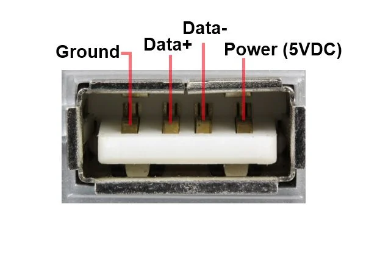
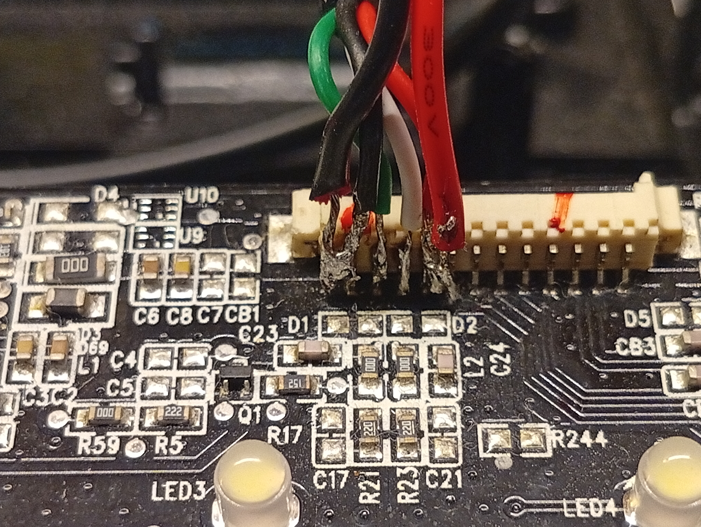
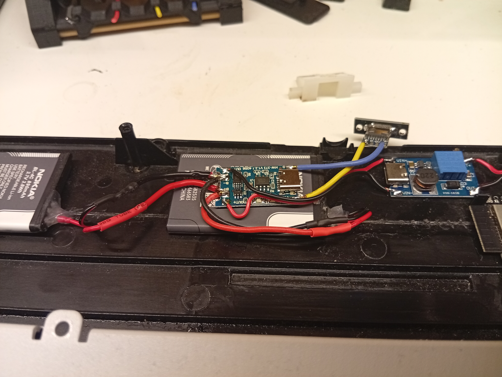
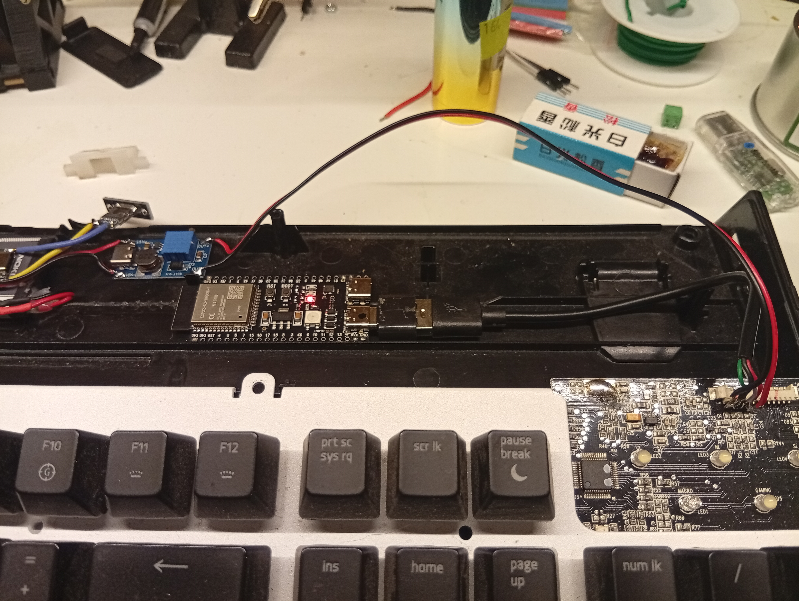

# BLE USB Keyboard — Klawiatura USB → Bezprzewodowa BLE (ESP32-S3)

> Projekt dokumentuje proces przeróbki klawiatury przewodowej (USB) na bezprzewodową przy użyciu mikrokontrolera **ESP32-S3** i protokołu **Bluetooth Low Energy (BLE)**.

---

## 📋 Spis treści

- [Opis projektu](#opis-projektu)
- [Komponenty](#komponenty)
- [Schemat połączeń](#schemat-połączeń)
- [Oprogramowanie i środowisko](#oprogramowanie-i-środowisko)
- [Instalacja i konfiguracja](#instalacja-i-konfiguracja)
- [Przebieg realizacji](#przebieg-realizacji)
- [Zdjęcia i wyniki](#zdjęcia-i-wyniki)
- [Znane problemy](#znane-problemy)
- [Plany rozwoju](#plany-rozwoju)
- [Literatura i zasoby](#literatura-i-zasoby)
- [Licencja](#licencja)

---

## Opis projektu

<!-- TODO: Opisz cel projektu. Jaką klawiaturę przerobiłeś? Dlaczego wybrałeś ESP32-S3 i BLE? -->

Ten projekt pokazuje, jak przerobić standardową klawiaturę USB na bezprzewodową BLE przy minimalnej ingerencji w oryginalny sprzęt. Mikrokontroler **ESP32-S3** pełni rolę pośrednika: odbiera sygnały z matrycy klawiszy lub bezpośrednio z interfejsu USB klawiatury i wysyła je jako zdarzenia HID przez Bluetooth Low Energy.

**Klawiatura:** <!-- TODO: np. „Logitech K120", „mechaniczna klawiatura XYZ" -->  
**Cel:** bezprzewodowa praca z urządzeniami obsługującymi BLE HID (laptop, tablet, smartfon)

---

## Komponenty

### Elektronika

| Komponent | Ilość | Uwagi |
|-----------|-------|-------|
| ESP32-S3 (moduł/devkit) | 1 | <!-- TODO: podaj konkretny model, np. ESP32-S3-DevKitC-1 --> |
| Klawiatura USB do przeróbki | 1 | <!-- TODO: model klawiatury --> |
| Akumulator Li-Ion / LiPo | 1 | <!-- TODO: pojemność, np. 1000 mAh --> |
| Moduł ładowania TP4056 | 1 | opcjonalnie |
| Konwerter USB-A (wtyczka) | 1 | do podłączenia istniejącego kabla klawiatury |
| Kondensatory, rezystory | wg schematu | <!-- TODO: uzupełnij --> |
| Obudowa / mocowanie | — | <!-- TODO: druk 3D, modyfikacja oryginału itp. --> |

### Narzędzia

- Lutownica + cyna
- Multimetr
- <!-- TODO: inne narzędzia -->

---

## Schemat połączeń

<!-- TODO: Wstaw schemat elektryczny (obrazek lub link do pliku w repozytorium). -->
<!-- Przykład:  -->

```
[Klawiatura USB]
      |
   USB D+ / D-
      |
  [ESP32-S3]  ←→  BLE HID  ←→  [Komputer / Tablet]
      |
  [Akumulator]
```

> Szczegółowy schemat będzie dostępny w: `docs/schematic.pdf` *(do dodania)*

---

## Oprogramowanie i środowisko

### Wymagania

- [Arduino IDE](https://www.arduino.cc/en/software) ≥ 2.x **lub** [ESP-IDF](https://docs.espressif.com/projects/esp-idf/en/latest/) ≥ 5.x
- Wsparcie dla płytki ESP32-S3:
  - Arduino: dodaj URL w menedżerze płytek: `https://raw.githubusercontent.com/espressif/arduino-esp32/gh-pages/package_esp32_index.json`
  - ESP-IDF: oficjalne SDK Espressif
- Biblioteki:
  - <!-- TODO: np. `ESP32-BLE-Keyboard` (https://github.com/T-vK/ESP32-BLE-Keyboard) -->
  - <!-- TODO: np. `USB Host Shield Library 2.0` jeśli używasz USB Host -->

### Konfiguracja środowiska

```bash
# Klonowanie repozytorium
git clone https://github.com/areisigma/ble-usb-keyboard.git
cd ble-usb-keyboard

# TODO: opisz kolejne kroki instalacji zależności
```

---

## Instalacja i konfiguracja

1. **Zainstaluj środowisko** zgodnie z sekcją [Oprogramowanie i środowisko](#oprogramowanie-i-środowisko).
2. **Otwórz projekt** w Arduino IDE / ESP-IDF.
3. **Dostosuj konfigurację** w pliku `config.h` *(do dodania)*:
   ```c
   // TODO: przykładowe parametry konfiguracyjne
   #define DEVICE_NAME   "BLE Keyboard"
   #define BATTERY_PIN   GPIO_NUM_1
   ```
4. **Wgraj firmware** na ESP32-S3:
   - Podłącz płytkę przez USB.
   - Wybierz właściwą płytkę i port w IDE.
   - Kliknij *Upload* / uruchom `idf.py flash`.
5. **Sparuj klawiaturę** z urządzeniem docelowym przez Bluetooth.

---

## Przebieg realizacji

### Etap 1 — Analiza klawiatury

<!-- TODO: Opisz, jak zbadałeś oryginalną klawiaturę. Czy używałeś USB HID, matrycy klawiszy, czy interfejsu PS/2? -->
Zacząłem od rozpoznania jak w ogóle dobrać się do USB w klawiaturze. Multimetrem sprawdziłem które piny w złączu do piny na PCB.



### Etap 2 — Projekt elektroniki

<!-- TODO: Opisz decyzje projektowe: wybór ESP32-S3, zasilanie, integracja z klawiaturą. -->
Próbowałem różnych wersji ESP32: ESP32, ESP32-S3, ESP32-C3. Stanęło na ESP32-S3, bo ma hardware'owe wsparcie jako USB host, czyli urządzenie, które przyjmie dane od innego, peryferyjnego urządzenia, tj. klawiatura. Inne modele płytki muszą emulować USB host, co spowalnia odpowiedź klawiatury, zżera więcej energii i ma to też swoje wady.

Zatem ESP32-S3 ogranicza się do biblioteki obsługującej układ USB, a podłączenie płytki do klawiatury odbywa się przez podpięcie w odpowiedni port ESP wlutowanego w piny USB w klawiaturze kabelka USB-C.

Pozostało jedynie zasilanie - użyłem 2 baterii od starej Nokii (zadziwiające - miałem 2 świeżo wyprodukowane) jako źródło. Użyłem ich, bo są płaskie i względnie pojemne. Klawiatura oraz USB wymagają zasilania 5V. Baterie Li-ion w standardzie mają 3,7V (max. 4,2V), więc zastosowałem przetwornicę, aby podnieść napięcie. Wyjście z przetwornicy także wlutowałem w piny USB klawiatury, dzięki czemu zasilam klawiaturę i dostarczam prąd przez USB do ESP (ESP32 działa na 3,3V, ale zawiera stabilizator napięcia na wejściu).

Pomiędzy przetwornicą i baterią zastosowałem układ ładowania ogniw Li-ion z gniazdem USB-C, które wyprowadzone jest poza obudowę.

Do pinu 1 (ADC1_0 - konwerter analogowo-cyfrowy) podłączyłem dzielnik napięcia na 1M-ohmowych rezystorach, aby zmniejszyć napięcie z max. 4,2V na max. 2,1V, bo pomimo że ESP ma ogromną impedancję wejściową w ADC, nie można podać napięcia większego niż 3,3V - chyba że celem jest wyprodukowanie świeczki :)

### Etap 3 — Prototyp

<!-- TODO: Opisz budowę prototypu na płytce stykowej. Wstaw zdjęcia. -->
W ramach testów zasilałem układ bez baterii, tylko kablem USB-C przez przetwornicę (ma domyślnie wlutowany port USB-C).

Początkowo używałem zwykłego ESP32 i emulowanego USB hosta. Lutowanie przewodów w odpowiednie piny ESP32-S3 nie działało - nie było połączenia z klawiaturą. Emulacja działała i odbierałem bardzo opóźniony sygnał z klawiatury, ale z kolei wysyłanie tego przez BLE nie działało.

ESP32-C3 w ogóle nie byłem w stanie zaprogramować :D

Pewnego wieczoru pomyślałem, że w końcu to zrobię i zrealizuję to w najbardziej rzemieślniczy sposób - kabelkiem jw. Znalazłem projekt, który wykorzystał to samo podejście i na jego podstawie zrobiłem projekt.

### Etap 4 — Firmware

<!-- TODO: Opisz, jak działa oprogramowanie. Jakie biblioteki BLE HID zastosowałeś? -->
Oprogramowanie płytki jest zbudowane w środowisku PlatformIO, co pozwala na prostą konfigurację i wgranie na płytkę.

W odróżnieniu od pierwotnego projektu wprowadziłem nowelizacje związane ze śledzeniem stanu naładowania baterii. Podzielone napięcie baterii na 2 można następnie programowo pomnożyć razy 2, dzięki czemu uzyskuje się przybliżone napięcie na baterii. Rzeczywistość nie jest tak sielankowa i prawo Ohma swoje wie. Występuje pewien spadek napięcia w związku z równoległym obciążeniem, tj. ESP. W związku z czym układ pokazuje niepoprawny stan naładowania baterii.

### Etap 5 — Integracja i testy

<!-- TODO: Opisz montaż w obudowie, testy działania, czas pracy na baterii. -->
Z wnętrza obudowy klawiatury trzeba było usunąć trochę plastiku, aby wszystkie układy można było ułożyć maksymalnie płasko i w odpowiedniej odległości od spodu płyty PCB klawiatury, aby nie doszło do zwarć. Baterie i układy przyklejone są do wewnętrznej strony obudowy za pomocą kleju na gorąco - szybkie i wystarczające, by układy nie latały w środku, a na tyle łatwe w odklejeniu, że nie będzie problem z serwisem lub wymianą modułów.


---

## Zdjęcia i wyniki

<!-- TODO: Wstaw zdjęcia gotowego projektu. -->
<!-- Przykład:


-->

| Widok | Opis |
|-------|------|
| ** | Wnętrze klawiatury z ESP32-S3 |
| ** | Wnętrze klawiatury z ESP32-S3 |

**Czas pracy na baterii:*2-3h* (przy 1780mAh) <!-- TODO: np. „~2 tygodnie przy codziennym użytkowaniu" -->  
**Opóźnienie (latency):*<50ms* <!-- TODO: np. „< 10 ms" -->

---

## Znane problemy

<!-- TODO: Opisz napotkane problemy i ich rozwiązania lub obecne ograniczenia. -->

- [ ] Nie działa z moim komputerem (mam zły adapter bluetooth, lub sterowniki w komputerze działają niepoprawnie)
- [ ] ESP odczytuje niepoprawny stan baterii w związku z prawami natury znanymi szerzej jako prawo Ohma

---

## Plany rozwoju

<!-- TODO: Co chciałbyś jeszcze dodać lub ulepszyć? -->

- [ ] Połączenie USB-C do programowania ESP32-S3
- [ ] Dokończenie obudowy
- [ ] Montaż większej baterii (np. celi z baterii laptopa)
- [ ] Obsługa wbudowanego w klawiaturę dodatkowego USB

---

## Literatura i zasoby

- [ESP32-S3 — dokumentacja techniczna (Espressif)](https://docs.espressif.com/projects/esp-idf/en/latest/esp32s3/)
- [Projekt baza](https://github.com/KoStard/ESP32S3-USB-Keyboard-To-BLE)

---

## Licencja

<!-- TODO: Wybierz licencję, np. MIT, GPL-3.0 lub inna. -->

Projekt udostępniony na licencji MIT.
